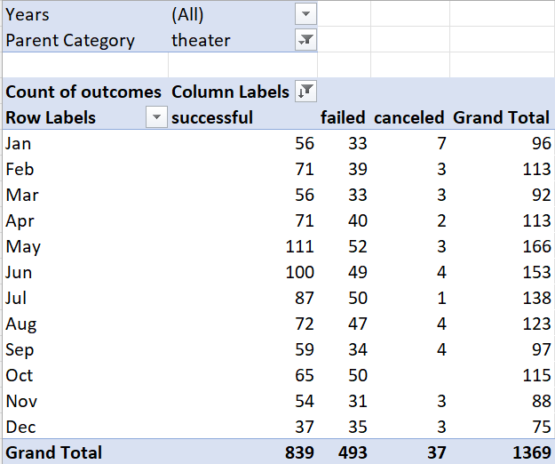
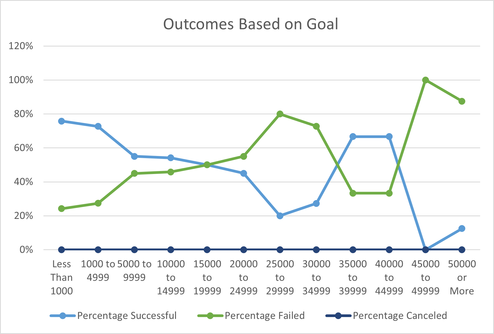
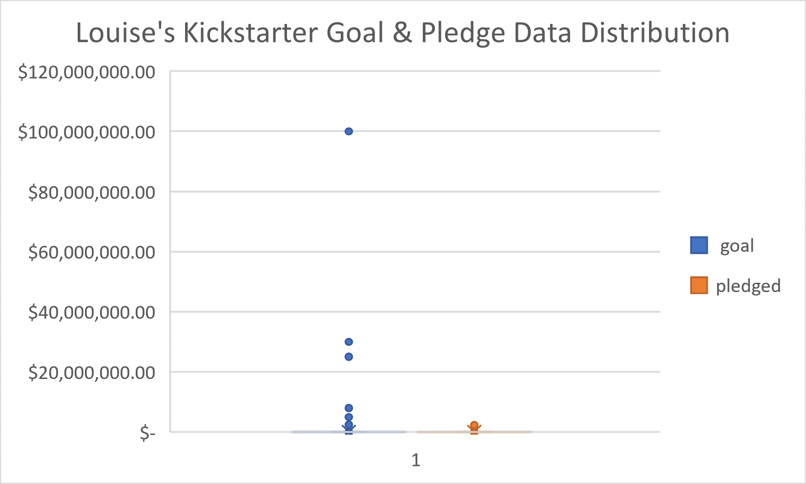

# Kickstarting with Excel

## Overview of Project
Performed analysis on the Outcomes based on Launch Date and the Outcomes based on Goals for Louise's Kickstarter.

### Purpose
The purpose was to adequately visualize data for Louise's campaign to kickstart the play _Fever._

## Analysis and Challenges
This analysis was created in Microsoft Excel using the Pivot Table and graph making functions. No difficulties were encountered during this analysis, however, possible challenges may include properly defining the COUNTIFS() function for the Outcomes Based on Goals as well as utilizing the correct fields for the pivot table created for the analysis of the Outcomes Based on Launch Date.

### Analysis of Outcomes Based on Launch Date
Using the Date Created Conversion column the Launch Year was found using the YEAR() function, as shown below. From this, a pivot table is created (**Figure 1.1**) showing the Date Created Conversion in the rows, Outcomes in the columns, Values of Outcomes shown by value, and filtered by Year and Parent Category. In order to look at the Theater Outcomes Based on Launch Date (**Figure 1.2**) the Parent Category must be filtered by theater.

<b>Figure 1.1</b>

<b>Figure 1.2</b>

#### Examples of Code Used in Outcomes Based on Launch Date
1. =YEAR(Q2)

### Analysis of Outcomes Based on Goals

Using the Outcomes column the Number of Successful, Number of Failed, and Number of Canceled were found using the COUNTIFS() function that was utilized to count based on specific Goal values, as shown below. Using the data pulled from the Kickstarter sheet provided, the total projects for each numbered range of Goals were found using the SUM() function, as shown below, of all of the possible outcomes for that range. The percentages for each outcome were also found by using the basic division arithmetic function where the number of outcomes found for each goal range was divided by the total projects for that same goal range. Using the goal ranges and the percentages successful, failed, and canceled a line graph was created (**Figure 2.1**).

<b>Figure 2.1</b>

#### Examples of Code Used in Outcomes Based on Goals
1. =COUNTIFS(Kickstarter!D:D,"<1000",Kickstarter!O:O,"plays",Kickstarter!F:F,"successful")
2. =SUM(B2:D2)

### Challenges and Difficulties Encountered

Possible difficulties encountered performing this code may be the ability to use the COUNTIFS function, this function requires a lot of inputs to work correctly for the data needed. It is important to reference the datasheet provided above if problems running the data are encountered.

## Results

- What are two conclusions you can draw about the Outcomes based on Launch Date?

It is best to launch a theater Kickstarter between April and May due to the success rate increase found between April and May. It is also not recommended to start a theater Kickstarter in the later months of the year as seen by the drastic decrease in success nearing December. 

- What can you conclude about the Outcomes based on Goals?

The outcomes for the Kickstarters based on the goals set seem to follow a particular trend aside from some deviation found between goals set between $35,000 - $44,999. The outcomes for Kickstarters tend to have higher success rates with lower goals, this is seen by the steady decline of success rates and the steady increase of failure rates.

- What are some limitations of this dataset?

In the box and whisker plot graph below (**Figure 3.1**) it is easily seen that the distribution of the goal and the pledged amounts have a very large range with both very large numbers and very small numbers. These visible outliers in the data do not seem to have an effect on the data analysis covered above because in the Outcomes Based on Goals the outcomes were separated into groups based on ranges of goal amounts. However, when doing future analyses, it is important to assess how these outliers may affect the data.

<b>Figure 3.1</b>

- What are some other possible tables and/or graphs that we could create?

A clustered column graph could be utilized to show the data, however, using this graph shows the trends over time but not as efficiently as the line graph chosen to showcase the data. A box & whisker plot graph was created to show how the data was distributed in regards to the goals and the pledged amounts. This graph was proven useful in finding the possible limitations of the data, this graph also visualizes the data so that different measures may be taken in response to the number of outliers present.

## Questions

* You can contact me via email or GitHub!

    * Email: emilyporter920@gmail.com
    * GitHub Profile: Emily Porter || github.com/emilyporter920 
